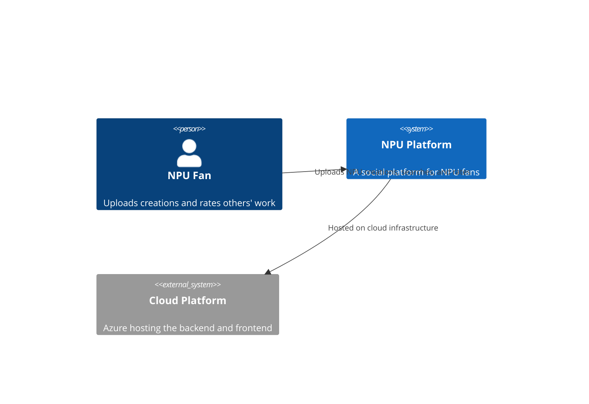
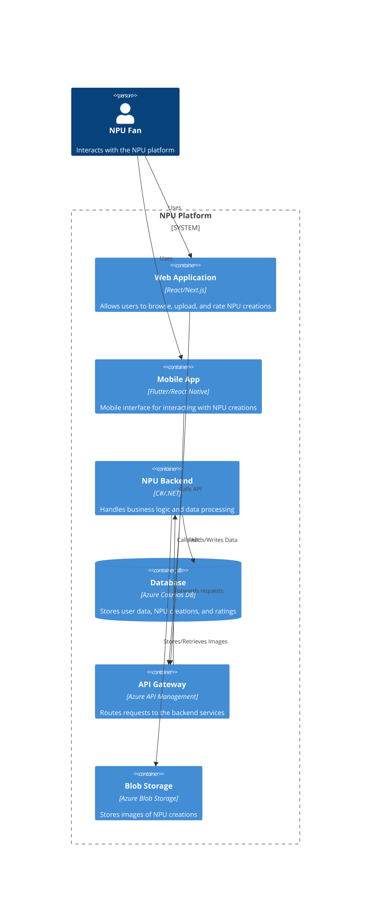

# NPU Backend

## Context Diagram

```mermaid
C4Context
    Person(user, "NPU Fan", "Uploads creations and rates others' work")
    System(npuPlatform, "NPU Platform", "A social platform for NPU fans")
    System_Ext(cloudHosting, "Cloud Platform", "Azure hosting the backend and frontend")

    Rel(user, npuPlatform, "Uploads NPU creations, searches, and rates")
    Rel(npuPlatform, cloudHosting, "Hosted on cloud infrastructure")
```

## Container Diagram

```mermaid
C4Container
    Person(user, "NPU Fan", "Interacts with the NPU platform")

    System_Boundary(npuSystem, "NPU Platform") {
        Container(webApp, "Web Application", "React/Next.js", "Allows users to browse, upload, and rate NPU creations")
        Container(mobileApp, "Mobile App", "Flutter/React Native", "Mobile interface for interacting with NPU creations")
        Container(npuBackend, "NPU Backend", "C#/.NET", "Handles business logic and data processing")
        ContainerDb(database, "Database", "Azure Cosmos DB", "Stores user data, NPU creations, and ratings")
        Container(apiGateway, "API Gateway", "Azure API Management", "Routes requests to the backend services")
        Container(blobStorage, "Blob Storage", "Azure Blob Storage", "Stores images of NPU creations")
    }

    Rel(user, webApp, "Uses")
    Rel(user, mobileApp, "Uses")
    Rel(webApp, apiGateway, "Calls API")
    Rel(mobileApp, apiGateway, "Calls API")
    Rel(apiGateway, npuBackend, "Forwards requests")
    Rel(npuBackend, database, "Reads/Writes Data")
    Rel(npuBackend, blobStorage, "Stores/Retrieves Images")
```