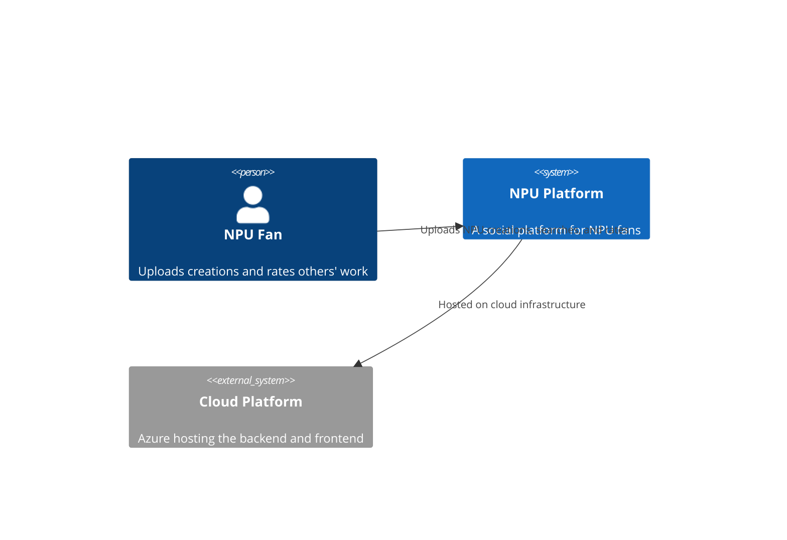
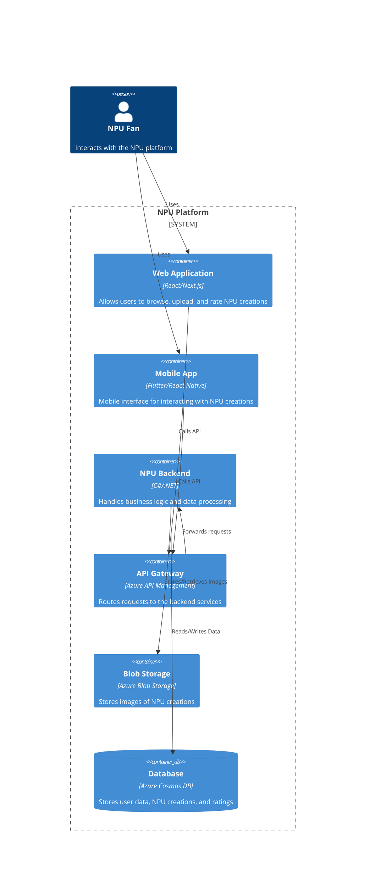

# NPU Backend

[](https://github.com/trolund/npu/actions/workflows/main.yml)

## Overview

### Scope

No users are modeled in the system and not authentication is implemented. 

The system is a simple backend for a social platform where users can upload NPU creations and rate others' work. 
The system is hosted on Azure and uses **Azure Cosmos DB** for storing data and **Azure Blob Storage** for storing images.

### Folder structure:

```
📂 ProjectRoot  
├── 📁 .github (GitHub actions)  
│   ├── 📁 workflows (GitHub actions workflows pipeline)  
├── 📁 infrastructure (Azure infrastructure as code)  
├── 📁 scripts (Scripts for local development)  
├── 📁 src (Source code)  
├── 📄 README.md  
└── 📄 Requirements.md  
```

### Project structure (src folder):

```
📂 NPU (9 projects)
├── 📁 NPU.Api (Api controllers)
├── 📁 NPU.ApiTests (Api tests)
├── 📁 NPU.BI (Business logic)
├── 🌐 NPU.Client (Frontend - have not been implemented ❌)
├── 📁 NPU.Data (Data access)
├── 📁 NPU.End2EndTests (End-to-end tests - have not been implemented ❌)
├── 📁 NPU.FuncApp (Azure Function App - have not been implemented ❌))
├── 📁 NPU.Infrastructure
└── 📁 NPU.UnitTests
```

The application have NOT been tested properly and the test project are simply examples of how to write tests.

### Context Diagram



### Container Diagram


