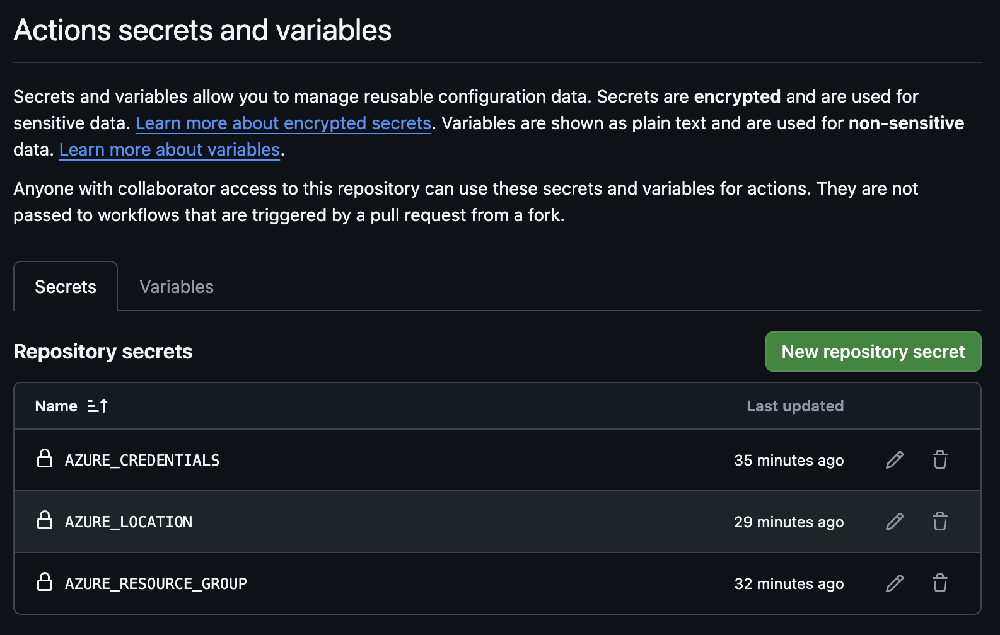

# Lock Note

## 🚀 Up and running

### Locally

Run the cosmos emulator in docker by running the script `cosmosdblocalsetupScript.sh`

```bash
./scripts/cosmosdblocalsetupScript.sh
```

Then just run the project and everything should work.

### In the Cloud ☁️

Use azure cli to create service principal:

```bash
az ad sp create-for-rbac --name "github-actions-bicep-deploy" --role contributor \
  --scopes /subscriptions/<subscription-id> --sdk-auth
```

#### Create secrets

this will output a JSON object this entire object should be put in to the secret `AZURE_CREDENTIALS` as seen on the picture below:



`AZURE_LOCATION` can be set to *northeurope* for the North Europe data center. `AZURE_RESOURCE_GROUP` is set to the *subscription-id* of the subscription in Azure.

## Run tests with UI

```bash
dotnet test --settings:LockNote.End2EndTests/.runsettings
```
